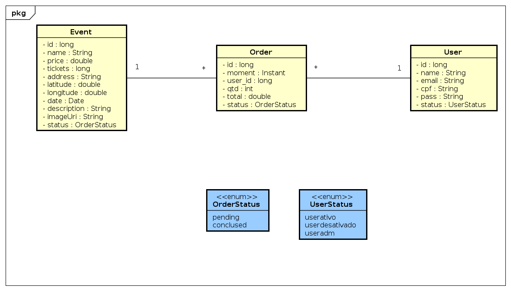

# Contagem de Pontos de Função

A contagem em **Pontos de Função (PF)** permite a determinação do **Tamanho Funcional** do projeto de software.
A análise de ponto de função (APF) é um processo para a identificação e contagem das funcionalidades baseadas nos conceitos 
de **Funções de Dados** e **Funções de Transação**. 

Os conceitos relacionados com dados são os **Arquivos de Lógica Interna (ALI)** e os **Arquivos de Interface Externa (AIE)**, 
e os conceitos relacionados com operações externas a fronteira do sistema são: 
**Entrada Externa (EE)**, **Consulta Externa (CE)** e **Saída Externa (SE)**.

Existem várias práticas de contagem, cada uma com suas especificidades.

### Modelo de Dados
## 

### Contagem Indicativa

Na contagem indicativa (Ci) só é necessário conhecer e analisar as **Funções de Dados**. Desta forma, 
os **ALI**s (Arquivos Lógicos Internos) com o valor de *35 PF* cada e os **AIE**s (Arquivos de Interface Externa) com o valor de *15 PF* cada.

| Função de Dado  | Entidades Relacionadas | Tamanho em PF |
| --------------- | ---------------------- | :-----------: |
| ALI Event     | Event e EventStatus   | 35 PF         |
| ALI Landing page | -  | 35 PF         |
| ALI Order | Order e OrderStatus  | 35 PF         |
| ALI User| User e UserStatus | 35 PF         |
| **Total**       | **Ci**                 | **140 PF**  |

### Contagem Estimativa

Analisa todas as funções da dados (ALI’s e AIE’s) com complexidade baixa, 7 PF cada ALI e 5 PF para cada AIE).
Analisa todos os processos elementares como médios EE (4 PF), CE (4 PF) e SE (5 PF). 

Nomes em inglês: External Inputs (EI), External Inquiry (EQ) e External Outputs (EO).

| Função de Dado  | Tipo de função | Complexidade | PF |
| ------------ | ---------- | ---------- | :-----------: |
| ALI Event     | ALI   | Baixa         |   7   | 
| ALI Landing Page | ALI  | Baixa         |       7    | 
| ALI Order | ALI  | Baixa         |       7    | 
| ALI User| ALI | Baixa        |     7      | 
| Inserir Event     | EE   | Média         |   4   | 
| Atualizar Event     | EE   | Média         |   4   | 
| Deletar Event     | EE   | Média         |   4   | 
| Consultar Event     | CE   | Média         |   4   | 
| Detalhar Event     | SE   | Média         |   5   | 
| Inserir Order     | EE   | Média         |   4   | 
| Atualizar Order     | EE   | Média         |   4   | 
| Deletar Order     | EE   | Média         |   4   | 
| Consultar Order     | CE   | Média         |   4   | 
| Detalhar Order     | SE   | Média         |   5   | 
| Inserir User     | EE   | Média         |   4   | 
| Atualizar User     | EE   | Média         |   4   | 
| Deletar User    | EE   | Média         |   4   | 
| Consultar User     | CE   | Média         |   4   | 
| Detalhar User     | SE   | Média         |   5   | 
| **Contagem Estimativa não ajustada**   |  |      | **91**  |
| **Fator de Ajuste Mínimo - 65%**  |   |       | **59,15**  |
| **Fator de Ajuste Máximo 135%**       |   |       | **122,85**  | 

### Contagem Detalhada

A contagem Detalhada (Cd) analisa todas as funções da dados (ALI’s e AIE’s) classificando com complexidades baixa, média e alta. Também analisa todas as transações classificando sua complexidade em baixa, média e alta conforme tabela de contribuições.

| Descrição  | Tipo | DER | RLR | Complexidade | Contribuição |
| ------------ | ---------- |---------- |---------- | ---------- | :-----------: |
| ALI Event     | ALI   | 10 | 2 |   Baixa         |   7   | 
| ALI Order | ALI  | 5 | 2 |Baixa   |           7    | 
| ALI User| ALI | 6 |    1  |Baixa     |     7      | 
| Inserir Event     | EE   |  |  | Média      |   3   | 
| Atualizar Event     | EE   | |  | Média   |   4   | 
| Deletar Event     | EE   | |  | Média     |   4   | 
| Consultar Event     | CE   | |  | Média    |   4   | 
| Detalhar Event     | SE   | |  | Média    |   4   | 
| Inserir Order     | EE   | |  | Média   |   3   | 
| Atualizar Order     | EE   | |  | Média     |   4   | 
| Deletar Order     | EE   | |  | Média    |   4   | 
| Consultar Order     | CE   | |  | Média    |   4   | 
| Detalhar Order     | SE   | |  | Média     |   4   | 
| Inserir User     | EE   | |  | Média    |   3   | 
| Atualizar User     | EE   | |  | Média    |   4   | 
| Deletar User    | EE   | |  | Média   |   4   | 
| Consultar User     | CE   | |  | Média    |   4   | 
| Detalhar User     | SE   | |  | Média     |   4   | 
| **Contagem Detalhada**   | |  |   |      | **78**  |
| **Fator de Ajuste Mínimo - 65%**  |   | |  |       | **50,7**  |
| **Fator de Ajuste Máximo 135%**       |   | |  |      | **105,3** | 

