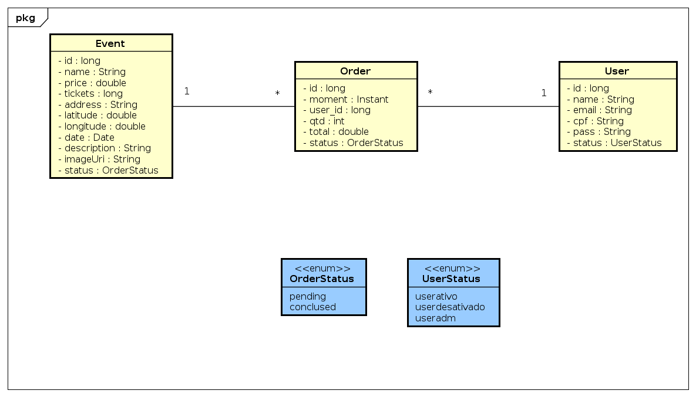

# Documento de Modelos

Neste documento foi utilizado o modelo de dados em nível de análise, descrevendo também as entidades e finalizando com o dicionário de dados.

## Modelo de Dados
## 

## Descrição das Entidades

Abaixo temos uma breve descrição das entidades que compõe o sistema.

| Entidade | Descrição   |
|----------|------------------------------------------------------------------------------------------------------------------------------------------------------|
| Evento   | A entidade Evento possui diversos atributos, dentre eles temos os atributos de name, adress e date, para definir a data do evento, nome e endereço do evento, assim como inumeras outras informações que localizão e precificam o evento de forma descritiva.                                |
| Usuário   | A entidade usuário é usada para armazenar os dados pessoais e gerenciar permissões do usuario para identifica-lo de forma a criar reservas e eventos.                                                              |
| Order   | A entidade order é usada para armazenar os dados de compra daquele evento, como por exemplo o momento da compra, quem comprou e qual valor, assim como a situação da compra.                              

## Dicionário de Dados

O dicionário de dados consiste em um conjunto de tabelas que fornecem informações sobre outras tabelas no banco de dados. Dessa forma, o dicionário de dados configura-se como um repositório de metadados, armazenado em um banco de dados relacional, descrevendo e mapeando as estruturas de dados do sistema.

## Tabela - Usuário

| Atributo  | Chave | Tipo de dado | Tamanho | Descrição                                     |
| --------- | :---: | :----------: | :-----: | --------------------------------------------- |
| id        |  PK   |   NUMERIC    |    4    | Identificador incremental de usuário.         |
| name      |  NN   | VARCHAR[100] |   100   | Nome real do usuário.                         |
| pass     |  NN   | VARCHAR[256] |   256   | Senha utilizada pelo usuário.                 |
| cpf  |  NN   |     VARCHAR[100]     |    100    | Informa o cpf do usuário.                |
| email     |  NN   | VARCHAR[256] |   256   | Email utilizado pelo usuário.                 |
| UserStatus     |  NN   | ENUM |   3   | Identifica as permissões do usuário.            |

## Tabela - Evento

| Atributo     | Chave | Tipo de dado | Tamanho | Descrição                                      |
| ------------ | :---: | :----------: | :-----: | ---------------------------------------------- |
| id           |  PK   |   NUMERIC    |    4    | Identificador incremental de evento.          |
| name         |  NN   | VARCHAR[100] |   100   | Nome do evento.                               |
| description    |  NN   | VARCHAR[280] |   280   | Descrição do evento.                          |
| adress    |  NN   | VARCHAR[280] |   280   | Endereço do evento.                          |
| latitude    |  NN   | Double |   50   | Informação de latitude do evento.                          |
| longitude    |  NN   | Double |   50   | Informação de longitude do evento.                          |
| date |  NN   |     DATE     |    3    | Data formato (XX-XX-XXXX).                     |
| imageUri      |  NN   |     VARCHAR[100]     |    100    | Armazena informação de local da imagem do evento |
| price      |  NN   |   NUMERIC    |    10    | Valor monetario do evento.                        |
| tickets |  NN   |   NUMERIC    |     10     | Capacidade do evento.                                    |
| status |  FK   |   ENUM    |     4     | Situação atual do evento.                                    |

## Tabela - Order

| Atributo     | Chave | Tipo de dado | Tamanho | Descrição                                      |
| ------------ | :---: | :----------: | :-----: | ---------------------------------------------- |
| id           |  PK   |   NUMERIC    |    4    | Identificador incremental da ordem de compra.          |
| user_id         |  FK   | NUMERIC |   4   | Id do usuário que adquiriu o evento.                               |
| qtd    |  NN   | NUMERIC |   50   | Quantidade de tickets adquiridos.                          |
| total    |  NN   | Double |   50   | Valor total da ordem de compra.                          |
| status |  FK   |   ENUM    |     4     | Situação atual da ordem de compra.                                    |
